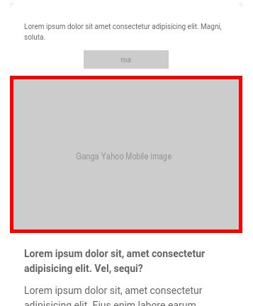

## Ganga Swap Image

I'm sharing here a piece of code that will be useful for all those who do image swapping on email (desktop image / mobile image). The **hybrid email template** already allows you to have an email body that fits on email clients that don't accept media queries. The columns are placed one below the other, and the display is that of a mobile phone. This is the **advantage over a responsive version** which will always display a desktop version on these mobiles (ganga, yahoo). However, there is still one problem to solve, the impossibility of displaying a mobile image on these recalcitrant clients. Ganga and yahoo always displayed the desktop image.
Thanks to Mark Robbins genius (see [here](https://github.com/hteumeuleu/email-bugs/issues/95), I finally managed to create an image swap that works, so that all mobile mail clients where media queries are not accepted will now display the mobile image !! . This code can certainly be simplified, optimized, : out of more than 80 mailboxes (according to testi@) only two are still problematic : **Zimbra**, which doesn't display any image at all (neither desktop nor mobile) and **wall! mail** which still displays the mobile version in desktop... 


### The code 

Here is the application of this technique using conditional comments <!--Yahoo-GANGA-><!yahoo-GANGA--> in a classic hybrid email template.

```
<!DOCTYPE html   PUBLIC "-//W3C//DTD XHTML 1.0 Transitional//EN" "http://www.w3.org/TR/xhtml1/DTD/xhtml1-transitional.dtd">
<html lang="fr" xml:lang="fr" xmlns="http://www.w3.org/1999/xhtml" xmlns:v="urn:schemas-microsoft-com:vml" xmlns:o="urn:schemas-microsoft-com:office:office">

<head>
<meta charset="utf-8">
<meta name="viewport" content="width=device-width">
<meta http-equiv="X-UA-Compatible" content="IE=edge">
<meta name="x-apple-disable-message-reformatting">
<meta name="format-detection" content="telephone=no,address=no,email=no,date=no,url=no">
<meta name="color-scheme" content="light">
<meta name="supported-color-schemes" content="light">
<title></title>
    <!--[if (gte mso 9)|(IE)]>
<style>
* {
font-family: Arial, sans-serif !important;
}
</style>
<![endif]-->
<!-- CSS Reset : BEGIN -->
<style>
 :root {
    color-scheme: light;
    supported-color-schemes: light;
}
html,
body {
    margin: 0 auto !important;
    padding: 0 !important;
    height: 100% !important;
    width: 100% !important;
}
div[style*="margin: 16px 0"] {
    margin: 0 !important;
}
table,
td {
    mso-table-lspace: 0pt !important;
    mso-table-rspace: 0pt !important;
}
table {
    border-spacing: 0 !important;
    border-collapse: collapse !important;
    table-layout: fixed !important;
    margin: 0 auto !important;
}
img.g-img+div {
    display: none !important;
}

</style>
<style>
a {
    text-decoration: none;
}
a[x-apple-data-detectors] {
    color: inherit !important;
    text-decoration: none !important;
    font-size: inherit !important;
    font-family: inherit !important;
    font-weight: inherit !important;
    line-height: inherit !important;
}

u+#body a {
    color: inherit;
    text-decoration: none;
    font-size: inherit;
    font-family: inherit;
    font-weight: inherit;
    line-height: inherit;
}

#MessageViewBody a {
    color: inherit;
    text-decoration: none;
    font-size: inherit;
    font-family: inherit;
    font-weight: inherit;
    line-height: inherit;
}
</style>
<style>
   /* iPhone 4, 4S, 5, 5S, 5C, and 5SE */
   @media only screen and (min-device-width: 320px) and (max-device-width: 374px) {
      u ~ div .email-container {
         min-width: 320px !important;
      }
   }
   /* iPhone 6, 6S, 7, 8, and X */
   @media only screen and (min-device-width: 375px) and (max-device-width: 413px) {
      u ~ div .email-container {
         min-width: 375px !important;
      }
   }
   /* iPhone 6+, 7+, and 8+ */
   @media only screen and (min-device-width: 414px) {
      u ~ div .email-container {
         min-width: 414px !important;
      }
   }
   @media screen and (-webkit-min-device-pixel-ratio: 0) {
      table[class="button"]:hover {
         opacity: 0.8;
      }
   }
   u + .body .glist { margin-left: 0 !important; }
   @media only screen and (max-width: 680px) {
      u + .body .glist { margin-left: 25px !important; }
   }
</style>
<!--[if gte mso 9]>
<xml>
<o:OfficeDocumentSettings>
<o:AllowPNG/>
<o:PixelsPerInch>96</o:PixelsPerInch>
</o:OfficeDocumentSettings>
</xml>
<![endif]-->
<style>
.btn-td,
.btn-a {
    transition: all 100ms ease-in;
}

.btn-td-primary:hover,
.btn-a-primary:hover {
    background: #646464 !important;
    border-color: #646464 !important;
}

.m-content {
    display: none !important;
    max-height: none !important;
    mso-hide: all;
}
   

  
      
   
@media screen and (max-width: 680px) {
    .cc-column,
    .cc-column-center {
        display: block !important;
        width: 100% !important;
        max-width: 100% !important;
        direction: ltr !important;
    }
    .cc-column table {
        height: auto !important;
    }
    .cc-column img {
        max-width: 100% !important
    }
    .cc-column-center {
        text-align: center !important;
    }
    .d-content {
        display: none !important;
    }
    .m-content {
        display: block!important;
        width: auto !important;
        max-height: 100% !important;
        overflow: visible!important;
        height: 100% !important;
    }
    .center-on-narrow {
        text-align: center !important;
        display: block !important;
        margin-left: auto !important;
        margin-right: auto !important;
        float: none !important;
    }
    table.center-on-narrow {
        display: inline-block !important;
    }
}
</style>


<style>
#MessageViewBody .samsung{
    height:280px !important;
}
  
.d-gangaYahoo{
    display:block !important;
    border:5px solid red;
}
</style>


 

<!--[if (gte mso 9)|(IE)]>
<style type="text/css">
table {border-collapse: collapse;}
</style>
<![endif]-->
</head>
<body style="margin: 0px; background-color: #F2F2F2; padding: 0px !important;">
    <center role="article" aria-roledescription="email" lang="fr" style="width: 100%;background-color: #F2F2F2;">
        <!--[if (gte mso 9)|(IE)]>
        <table role="presentation" border="0" cellpadding="0" cellspacing="0" width="100%" style="background-color: #F2F2F2;">
        <tr>
        <td>
        <![endif]-->
        <!-- Texte de pré-en-tête masqué visuellement : BEGIN -->
        <div style="max-height:0; overflow:hidden; mso-hide:all;" aria-hidden="true">
        </div>

        <div style="display: none; font-size: 1px; line-height: 1px; max-height: 0px; max-width: 0px; opacity: 0; overflow: hidden; mso-hide: all; font-family: sans-serif;">&zwnj;&nbsp;&zwnj;&nbsp;&zwnj;&nbsp;&zwnj;&nbsp;&zwnj;&nbsp;&zwnj;&nbsp;&zwnj;&nbsp;&zwnj;&nbsp;&zwnj;&nbsp;&zwnj;&nbsp;&zwnj;&nbsp;&zwnj;&nbsp;&zwnj;&nbsp;&zwnj;&nbsp;&zwnj;&nbsp;&zwnj;&nbsp;&zwnj;&nbsp;&zwnj;&nbsp;</div>
        <div style="max-width: 680px; margin: 0 auto;" class="email-container">
            <!--[if (gte mso 9)|(IE)]>
            <table align="center" border="0" cellspacing="0" cellpadding="0" width="680" role="presentation">
            <tr>
            <td align="center" valign="top">
            <![endif]-->
            <!-- Email Body : BEGIN -->
            <table role="presentation" cellspacing="0" cellpadding="0" border="0" width="100%" style="margin: auto;">
                <!-- Email Header : BEGIN -->
                <tr>
                    <td align="center" style="padding-left:7px;padding-right:7px;height:1px;mso-line-height-rule: exactly;line-height:1px;font-size:1px;">
                        <div style="display:block;height:1px;background-color:#ffffff;mso-line-height-rule: exactly;line-height:1px;font-size:1px;">&nbsp;</div>
                    </td>
                </tr>
                <tr>
                    <td align="center" style="padding-left:5px;padding-right:5px;height:1px;mso-line-height-rule: exactly;line-height:1px;font-size:1px;">
                        <div style="display:block;height:1px;background-color:#ffffff;mso-line-height-rule: exactly;line-height:1px;font-size:1px;">&nbsp;</div>
                    </td>
                </tr>
                <tr>
                    <td align="center" style="padding-left:4px;padding-right:4px;height:1px;mso-line-height-rule: exactly;line-height:1px;font-size:1px;">
                        <div style="display:block;height:1px;background-color:#ffffff;mso-line-height-rule: exactly;line-height:1px;font-size:1px;">&nbsp;</div>
                    </td>
                </tr>
                <tr>
                    <td align="center" style="padding-left:3px;padding-right:3px;height:1px;mso-line-height-rule: exactly;line-height:1px;font-size:1px;">
                        <div style="display:block;height:1px;background-color:#ffffff;mso-line-height-rule: exactly;line-height:1px;font-size:1px;">&nbsp;</div>
                    </td>
                </tr>
                <tr>
                    <td align="center" style="padding-left:2px;padding-right:2px;height:1px;mso-line-height-rule: exactly;line-height:1px;font-size:1px;">
                        <div style="display:block;height:1px;background-color:#ffffff;mso-line-height-rule: exactly;line-height:1px;font-size:1px;">&nbsp;</div>
                    </td>
                </tr>
                <tr>
                    <td align="center" style="padding-left:1px;padding-right:1px;height:1px;mso-line-height-rule: exactly;line-height:1px;font-size:1px;">
                        <div style="display:block;height:1px;background-color:#ffffff;mso-line-height-rule: exactly;line-height:1px;font-size:1px;">&nbsp;</div>
                    </td>
                </tr>
                <tr>
                    <td align="center" style="padding-left:1px;padding-right:1px;height:1px;mso-line-height-rule: exactly;line-height:1px;font-size:1px;">
                        <div style="display:block;height:1px;background-color:#ffffff;mso-line-height-rule: exactly;line-height:1px;font-size:1px;">&nbsp;</div>
                    </td>
                </tr>

                <tr>
                    <td align="center" style="font-size:0; padding: 10px 0 10px; background-color: #ffffff;" valign="top">
                        <!--[if (gte mso 9)|(IE)]>
                        <table role="presentation" border="0" cellspacing="0" cellpadding="0" width="680">
                        <tr>
                        <td valign="top" width="470">
                        <![endif]-->
                        <div class="cc-column" style="display:inline-block; margin: 0 -1px; width:100%; max-width:470px; vertical-align:top;">
                            <table border="0" cellpadding="0" cellspacing="0" role="presentation" width="100%">
                                <tr>
                                    <td>
                                        <table border="0" cellpadding="0" cellspacing="0" role="presentation" style="font-size: 14px; text-align: left;" width="100%">
                                            <tr>
                                                <td class="center-on-narrow" style="padding: 10px 20px; font-family: Arial, sans-serif; font-size: 10px; mso-line-height-rule: exactly;line-height: 15px; color: #646464;text-align:left">Lorem ipsum dolor sit amet consectetur adipisicing elit. Magni, soluta.</td>
                                            </tr>
                                        </table>
                                    </td>
                                </tr>
                            </table>
                        </div>
                        <!--[if (gte mso 9)|(IE)]>
                        </td>
                        <td valign="top" width="190">
                        <![endif]-->
                        <div class="cc-column" style="display:inline-block; margin: 0 -1px; width:100%; min-width:100px; max-width:190px; vertical-align:top;">
                            <table border="0" cellpadding="0" cellspacing="0" role="presentation" width="100%">
                                <tr>
                                    <td>
                                        <table border="0" cellpadding="0" cellspacing="0" role="presentation" width="100%">
                                            <tr>
                                                <td style="text-align: center"></td>
                                            </tr>
                                        </table>
                                    </td>
                                </tr>
                            </table>
                        </div>
                        <!--[if (gte mso 9)|(IE)]>
                        </td>
                        </tr>
                        </table>
                    <![endif]-->
                </td>
            </tr>
            <!-- Email Header : END -->
              <tr>
                    <td align="center" class="d-content">
                    <!--Yahoo-GANGA-> 
                    <div style="display:none" class="d-gangaYahoo">
                      
                    <!yahoo-GANGA-->
                      <a  href="https://www.redhat.com/"  target="_blank" style="-webkit-text-size-adjust: 100%; -ms-text-size-adjust: 100%; color: #646464; text-decoration: none;display:block"></a>
                		<!--Yahoo-GANGA-> 
                    
                    </div>
                
                    <div class="m-content" style="border:5px solid red">
                        <a href="https://www.ibm.com/" target="_blank" style="display:block; -webkit-text-size-adjust: 100%; -ms-text-size-adjust: 100%; color: #646464; text-decoration: none;">
                        </a>
                    </div>
                <!yahoo-GANGA-->
            </td>
        </tr>
                 
                <!--[if !mso]><!-->             
                <tr>
                    <td class="m-content samsung" style="text-align: center; width: 0; height: 0; overflow: hidden; float: none; mso-hide: all; background-color: #ffffff; display: none; max-height: 0px;">
                        <a href="https://www.ibm.com/" target="_blank" style="display:block; -webkit-text-size-adjust: 100%; -ms-text-size-adjust: 100%; color: #646464 ; text-decoration: none;">
                        </a>
                    </td>
                </tr>
                <!--<![endif]-->
   

                <!-- 2 Even Columns : BEGIN -->
                <tr>
                    <td align="left" valign="top" style="font-size:0; padding: 10px; background-color: #ffffff;">
                        <!--[if (gte mso 9)|(IE)]>
                        <table role="presentation" border="0" cellspacing="0" cellpadding="0" width="660">
                        <tr>
                        <td valign="top" width="330">
                        <![endif]-->
                        <div style="display:inline-block; margin: 0 -1px; width:100%; min-width:200px; max-width:330px; vertical-align:top;" class="cc-column">
                            <table role="presentation" cellspacing="0" cellpadding="0" border="0" width="100%">
                                <tr>

                                    <td align="left" style="padding: 10px;">
                                        <table role="presentation" cellspacing="0" cellpadding="0" border="0" width="100%" style="font-size: 14px; text-align: left;">
                                            <tr>
                                                <td valign="top" align="left" style="font-family: 'Arial', sans-serif;font-size:14px;mso-line-height-rule: exactly; line-height: 21px;color:#646464;">
                                                    <p style="margin:0;">
                                                        <strong>Lorem ipsum dolor sit, amet consectetur adipisicing elit. Vel, sequi?</strong>
                                                    </p>
                                                </td>
                                            </tr>
                                            <tr>
                                                <td style="padding-top: 10px;font-family: Arial, sans-serif; font-size:14px;  mso-line-height-rule: exactly;line-height: 21px;  color: #646464;text-align:left">
                                                    <p style="margin: 0;">Lorem ipsum dolor sit, amet consectetur adipisicing elit. Eius enim labore earum perspiciatis. Officiis sit facilis obcaecati optio consequuntur sunt iusto cumque aliquam voluptates. Esse, quibusdam
                                                        officiis? Est corporis rerum vitae ipsa unde nesciunt cum reprehenderit, libero accusamus facere consequatur. <strong style="color: #525ca3;">Lorem, ipsum.</strong> Lorem ipsum dolor sit amet consectetur
                                                    adipisicing elit. Assumenda ex nesciunt eos harum doloribus natus ab, veniam rerum.</p>

                                                </td>
                                            </tr>

                                        </table>
                                    </td>
                                </tr>
                            </table>
                        </div>
                        <!--[if (gte mso 9)|(IE)]>
                        </td>
                        <td valign="top" width="330">
                        <![endif]-->
                        <div style="display: inline-block; margin: 0 -1px; width: 100%; min-width: 200px; max-width: 330px; vertical-align: top;" class="cc-column">
                            <table align="center" role="presentation" cellspacing="0" cellpadding="0" border="0" width="100%">
                                <tr>
                                    <td align="center" valign="top" style="padding:10px;">
                                        <a href="https://www.intel.com/" target="_blank">
                                            
                                        </a>
                                    </td>
                                </tr>
                            </table>
                        </div>
                        <!--[if (gte mso 9)|(IE)]>
                        </td>
                        </tr>
                        </table>
                    <![endif]-->
                </td>
            </tr>
            <!-- 2 Even Columns : END -->
            <tr>
                <td align="center" style="padding: 10px;background-color: #ffffff;">
                    <!-- Button : BEGIN -->
                    <table role="presentation" cellspacing="0" cellpadding="0" border="0" style="margin: auto;">
                        <tr>
                            <td class="btn-td btn-td-primary" style="border-radius: 30px; background: #525ca3;text-align:center">
                                <a class="btn-a btn-a-primary" href="https://google.com/" style="border: 1px solid #525ca3; font-family: Arial,sans-serif; font-size:14px; mso-line-height-rule: exactly;line-height: 14px; text-decoration: none; padding: 10px 31px; color: #ffffff; font-weight:bold;display: block; border-radius: 30px;"><strong>lCal ot ncatoi</strong></a>
                            </td>
                        </tr>
                    </table>
                    <!-- Button : END -->
                </td>
            </tr>

            <tr>
                <td align="center" valign="top" style="font-size:0; padding: 10px; background-color: #ffffff;">

                    <table role="presentation" cellspacing="0" cellpadding="0" border="0" width="100%">
                        <tr>
                            <td style="padding:10px; font-family: Arial, sans-serif; font-size:14px; mso-line-height-rule: exactly;line-height: 21px; color: #646464;text-align:left">
                                <p style="margin:0">Lorem ipsum dolor sit amet consectetur, adipisicing elit. Reiciendis ipsum nihil similique culpa molestias. Culpa laborum reiciendis incidunt sint eos dolores mollitia minus nam amet repudiandae. Quos perferendis consequatur
                                esse sunt quisquam veritatis eveniet at, distinctio inventore voluptate.</p>
                            </td>
                        </tr>
                    </table>

                </td>
            </tr>


            <!-- 1 Column Text + Button : BEGIN -->
            <tr>
                <td style="background-color: #ffffff;">
                    <table role="presentation" cellspacing="0" cellpadding="0" border="0" width="100%">
                        <tr>
                            <td style="padding:20px">
                                <table align="left" role="presentation" cellspacing="0" cellpadding="0" border="0" style="margin: auto;">
                                    <tr>
                                        <td align="center" valign="middle">

                                            
                                        </td>
                                        <td align="center" valign="middle" style="border-left:2px solid #525ca3;padding-left:10px;font-family: Arial,sans-serif; font-size:14px; mso-line-height-rule: exactly;line-height: 17px;text-align:left;color:#525ca3;word-break: break-word;">
                                            <p style="margin: 0 0 4px;font-size:16px;mso-line-height-rule: exactly;line-height: 18px;text-transform:uppercase"><strong>Lorem, ipsum.</strong></p>
                                            <p style="margin:0 0 3px;font-size:16px;mso-line-height-rule: exactly;line-height: 18px;"><a style="color:#525ca3;-webkit-text-size-adjust:100%;-ms-text-size-adjust:100%;" href="https://www.apple.com/">Lorem, ipsum dolor.</a></p>
                                            <p style="margin:0 0 3px"><a style="color:#525ca3;-webkit-text-size-adjust:100%;-ms-text-size-adjust:100%;" href="https://www.redhat.com/" target="_blank">Lorem, ipsum dolor.</a></p>
                                            <p style="margin:0">Lorem ipsum dolor sit.</p>
                                        </td>
                                    </tr>
                                </table>
                            </td>
                        </tr>
                    </table>
                </td>
            </tr>


            <!-- 1 Column Text + Button : BEGIN -->
            <tr>
                <td>

                    <div style="display:inline-block; margin: 0 -1px; width:100%; max-width:680px; vertical-align:top;" class="cc-column">
                        <table bgcolor="#ffffff" role="presentation" cellspacing="0" cellpadding="0" border="0" width="100%">

                            <tr>
                                <td height="8" bgcolor="#525ca3" style="mso-line-height-rule: exactly; line-height:8px; font-size:8px;height:8px">&nbsp;</td>
                            </tr>
                            <tr>

                                <td height="4" bgcolor="#ffffff" style="mso-line-height-rule: exactly;line-height:4px; font-size:4px;height:4px">&nbsp;</td>
                            </tr>
                            <tr>
                                <td height="4" bgcolor="#BCBC1C" style="mso-line-height-rule: exactly;line-height:4px; font-size:4px;height:4px">&nbsp;</td>
                            </tr>
                        </table>
                    </div>


                </td>
            </tr>
            <!-- 1 Column Text : BEGIN -->
            <tr>
                <td height="30" style="padding: 20px; font-family: Arial, sans-serif; font-size:14px; color: #646464;background-color: #ffffff;">
                    <table role="presentation" cellspacing="0" cellpadding="0" border="0" width="100%">
                        <tr>
                            <td style="padding-top:0; font-family: Arial, sans-serif; font-size:14px; color: #646464;text-align:left">
                                <a href="https://www.intel.com/" target="_blank" style="-webkit-text-size-adjust: 100%; -ms-text-size-adjust: 100%; color: #646464 !important; text-decoration: none;display:block">
                                    
                                </a>
                            </td>
                        </tr>
                    </table>
                </td>
            </tr>
            <!-- 1 Column Text : END -->

            <!-- 1 Column Text : BEGIN -->
            <tr>
                <td style="padding-top:0;padding-right: 20px;padding-bottom:20px;padding-left:20px; font-family:Arial, sans-serif; font-size:10px; mso-line-height-rule: exactly;line-height: 15px; color: #999999;background-color: #ffffff;">
                    <table role="presentation" cellspacing="0" cellpadding="0" border="0" width="100%">
                        <tr>
                            <td style="font-family: Arial, sans-serif; font-size: 10px; mso-line-height-rule: exactly;line-height:15px; color: #999999;text-align:left">
                                <p style="margin: 0">ruoP naeottrcc fral’tnmoniIo eéMcdlia : <a href="https://www.intel.com/" target="_blank" style="color:#999999;text-decoration: underline; -webkit-text-size-adjust: 100%; -ms-text-size-adjust: 100%;">.oiamowfceaif/i.ciorowltwmsdamnnn</a></p>
                                <p style="margin:0">énphoéeTl supeid al réolotpMe : </p>
                                <p style="margin:0">oPur sel ccasVin : <a href="https://www.apple.com/" target="_blank" style="color: #999999; text-decoration: underline; -webkit-text-size-adjust: 100%; -ms-text-size-adjust: 100%;">0 &nbsp;580055 658</a> (isecrev te
                                    plpae tgu)astir
                                </p>
                                <p style="margin: 0">rPuo tosu sel rtusAe dtsoiurP : <a href="https://www.ibm.com/" target="_blank" style="color: #999999; text-decoration: underline; -webkit-text-size-adjust: 100%; -ms-text-size-adjust: 100%;">0 008 493 000 </a> ecivres(
                                    te apepl gr)astuit
                                </p>
                               

                            </td>
                        </tr>
                    </table>
                </td>
            </tr>
            <!-- 1 Column MENTIONS LEGALES : END -->

            <!-- bloc arrondi : BEGIN -->
            <tr>
                <td align="center" style="padding-left:1px;padding-right:1px;height:1px;mso-line-height-rule: exactly;line-height:1px;font-size:1px;">
                    <div style="display:block;height:1px;background-color:#ffffff;mso-line-height-rule: exactly;line-height:1px;font-size:1px;">&nbsp;</div>
                </td>
            </tr>
            <tr>
                <td align="center" style="padding-left:1px;padding-right:1px;height:1px;mso-line-height-rule: exactly;line-height:1px;font-size:1px;">
                    <div style="display:block;height:1px;background-color:#ffffff;mso-line-height-rule: exactly;line-height:1px;font-size:1px;">&nbsp;</div>
                </td>
            </tr>
            <tr>
                <td align="center" style="padding-left:2px;padding-right:2px;height:1px;mso-line-height-rule: exactly;line-height:1px;font-size:1px;">
                    <div style="display:block;height:1px;background-color:#ffffff;mso-line-height-rule: exactly;line-height:1px;font-size:1px;">&nbsp;</div>
                </td>
            </tr>
            <tr>
                <td align="center" style="padding-left:3px;padding-right:3px;height:1px;mso-line-height-rule: exactly;line-height:1px;font-size:1px;">
                    <div style="display:block;height:1px;background-color:#ffffff;mso-line-height-rule: exactly;line-height:1px;font-size:1px;">&nbsp;</div>
                </td>
            </tr>
            <tr>
                <td align="center" style="padding-left:4px;padding-right:4px;height:1px;mso-line-height-rule: exactly;line-height:1px;font-size:1px;">
                    <div style="display:block;height:1px;background-color:#ffffff;mso-line-height-rule: exactly;line-height:1px;font-size:1px;">&nbsp;</div>
                </td>
            </tr>
            <tr>
                <td align="center" style="padding-left:5px;padding-right:5px;height:1px;mso-line-height-rule: exactly;line-height:1px;font-size:1px;">
                    <div style="display:block;height:1px;background-color:#ffffff;mso-line-height-rule: exactly;line-height:1px;font-size:1px;">&nbsp;</div>
                </td>
            </tr>
            <tr>
                <td align="center" style="padding-left:7px;padding-right:7px;height:1px;mso-line-height-rule: exactly;line-height:1px;font-size:1px;">
                    <div style="display:block;height:1px;background-color:#ffffff;mso-line-height-rule: exactly;line-height:1px;font-size:1px;">&nbsp;</div>
                </td>
            </tr>
            <!-- bloc arrondi : BEGIN -->
        </table>
        <!-- Email Body : END -->
            <!--[if (gte mso 9)|(IE)]>
</td>
</tr>
</table>
<![endif]-->
</div>
        <!--[if (gte mso 9)|(IE)]>
</td>
</tr>
</table>
<![endif]-->
</center>

</body>

</html>

```

Fell free to use this code, test it and leave a comment or suggest improvements

### Explanations

1-In a first Yahoo-Ganga conditional comment we insert a div width a "display:none", then the desktop image. This one will be visible from all the desktop mailboxes but will be hided, thanks to the "display:none" declaration on the following webmails : yandex chrome / yandex firefox
yahoo chrome / yahoo firefox / yahoo safari / yahoo ie11
zimbra chrome
aol chrome / aol firefox
wall!Mail (mobile version) 


A d-content class is applied to the element surrounding the image (if not on the image directly) that allows to hide it in mobile version, so as not to find ourselves 
with two images in mobile (desktop image + mobile image).
With the class="d-gangaYahoo" we finaly display that desktop image on those webmails.


--------------------------------------------------------   
--------------------------------------------------------
2-Inside a second conditional comment, we put the Yahoo-Ganga mobile image:
This is for the following mailboxes in mobile : 
android 6 gmail imap
android 6 yahoo
android 5 mail imap
android 4 gmail push 
As the code is wrapped in a Yahoo-Ganga conditionnal comment, this image (with a red border) will only be visible on those mobile email clients.

----------------------------------------------------------
-----------------------------------------------------------

3-Finally, in a third mso-conditional comment we insert the mobile image that will be visible from all other terminals and mobile mailboxes
Here the class m-content (for mobile-content) allows to display the image only for moiles (except of course for yahoo and ganga).

### Limits
Two webmails are problematic: on zimbra, no image is displayed, and wall! email displays the mobile image instead of the desktop image.
This technique is working apporximately on 98% of the mailboxes tested on testi@


